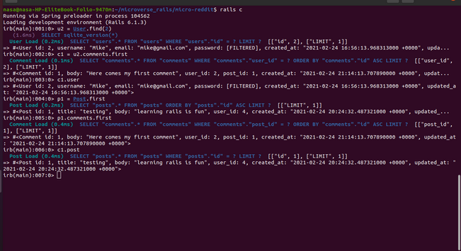

 
# Building a Micro-reddit
> This project involves using Active records concepts to implement micro-reddit application based on ruby on rails. 

## Documentation

This tool is very easy to use, please follow the instructions bellow to install and enjoy using it from your rails console :D.

## Built With
* Ruby On Rails
- [Ruby](https://www.ruby-lang.org/en/) 2.7.2
- [Ruby Gems](https://rubygems.org/)
  - [Rails](https://guides.rubyonrails.org/index.html) 6.1.3
- [SQLite3](https://www.sqlite.org/index.html)

  
## Getting Started

Follow these simple steps to get started:

### Installations
For running this program locally, you need to:
- [Install Ruby](https://www.ruby-lang.org/en/downloads/)
- [Install Rails](https://guides.rubyonrails.org/v5.0/getting_started.html)
- [Install git](https://git-scm.com/book/en/v2/Getting-Started-Installing-Git)

> Note: as discussed below, downloading the source code without `git` is possible.

### Set up

Once Ruby and Gem rails are installed, get a copy of this project by:
- Cloning the repository using `git`
  * `git clone https://github.com/ixboy/micro-reddit.git`

- Downloading a zip with the source code
  * Click [here](https://github.com/ixboy/micro-reddit/archive/development.zip)
  * Once  downloaded, extract it in a place with easy access to a terminal

Once Ruby and rails are both installed, and you have a copy of the source code, open the terminal and navigate to the folder where the code is:
- For Windows users, check [this](https://www.technoloxy.com/tutorials/cmd-navigate-view-run/) article.
- For UNIX/UNIX-like users such as Linux and macOS users, check [this](https://swcarpentry.github.io/shell-novice/02-filedir/index.html) article.

Install the Gems by running `bundle install`. You may need to provide your user password. For more information about Ruby's `bundle`, check [here](https://bundler.io/man/bundle-install.1.html).

### Usage

- From the root directory(micro-reddit), change into the Rails console terminal by running the following command and start using the tool...

 * `rails console`

## Authors 1

👤 **Iyunda Ismael Antonio**

- GitHub: [@ixboy](https://github.com/ixboy)
- Twitter: [@ismaelixboy](https://twitter.com/ismaelixboy)
- LinkedIn: [ismael-antonio](https://www.linkedin.com/in/ismaelantonio/)

## Authors 2

👨‍💻 **Kalu Chinasa Agu**

- [@Nasa28](https://github.com/Nasa28)
- [@Ultimate_Nasa](https://twitter.com/Ultimate_Nasa)
- [LinkedIn](https://www.linkedin.com/in/kalu-chinasa-agu-a15080103/)

## 🤝 Contributing

Contributions, issues, and feature requests are welcome!

Feel free to check the [issues page](https://github.com/ixboy/micro-reddit/issues).

## Acknowledgments

-  

## Show your support

Give a ⭐️ if you like this project!

## 📝 License

This project is MIT licensed.
